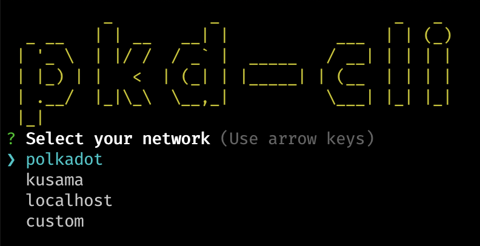
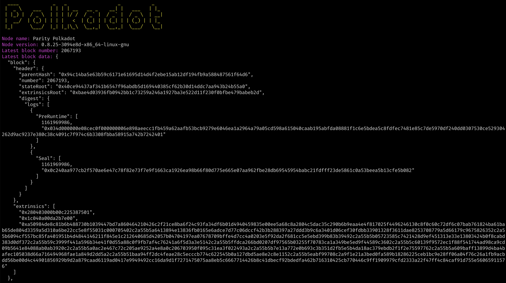

# Back-End Javascript

- Link: https://gitcoin.co/issue/Polkadot-Network/hello-world-by-polkadot/13/100023939

# How to use pkd-cli

- Clone repo
- Install dependencies: `npm install`
- Run the script: `node index.js`

# Resources

- https://www.sitepoint.com/javascript-command-line-interface-cli-node-js/
- https://github.com/polkadot-js/api
