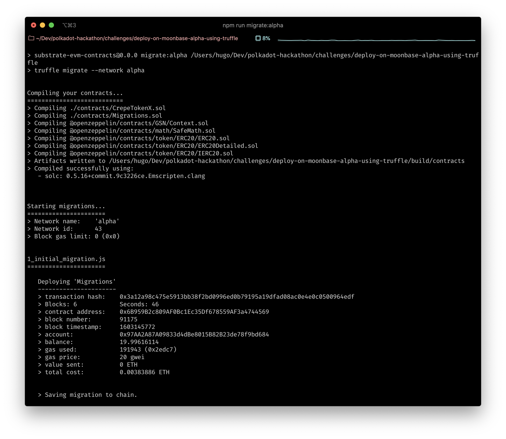
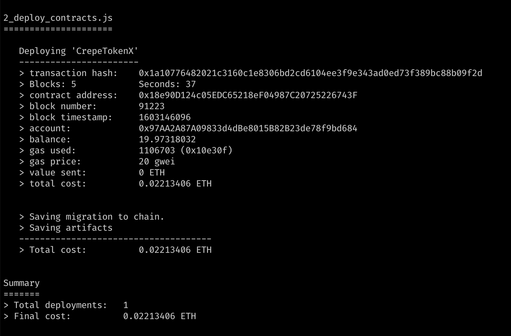

# Deploy On Moonbase Alpha Using Truffle

- Link: https://gitcoin.co/issue/PureStake/gitcoin-hello-world-by-moonbeam/1/100023953
- Status: Submitted [link](./addresses.txt) ✅

# Result

- migrationsAddress: `0x6B959B2c809AF0Bc1Ec35Df678559AF3a4744569`
- tokenAddress: `0x18e90D124c05EDC65218eF04987C20725226743F`

# Notes

Code imported from: https://github.com/PureStake/moonbeam/tree/master/tools/truffle

- install: `npm i`
- compile: `npm run compile`
- deploy: `npm run migrate:alpha`

# Resources

- https://docs.moonbeam.network/getting-started/local-node/using-truffle/
- https://docs.moonbeam.network/getting-started/testnet/connect/
