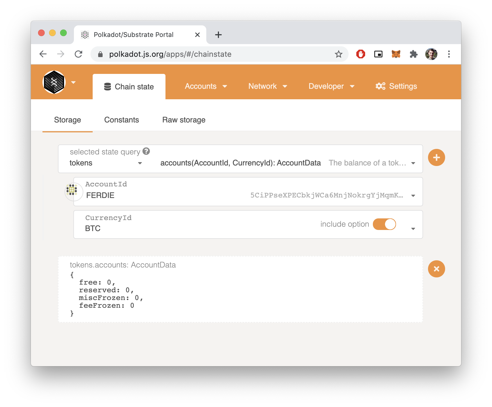
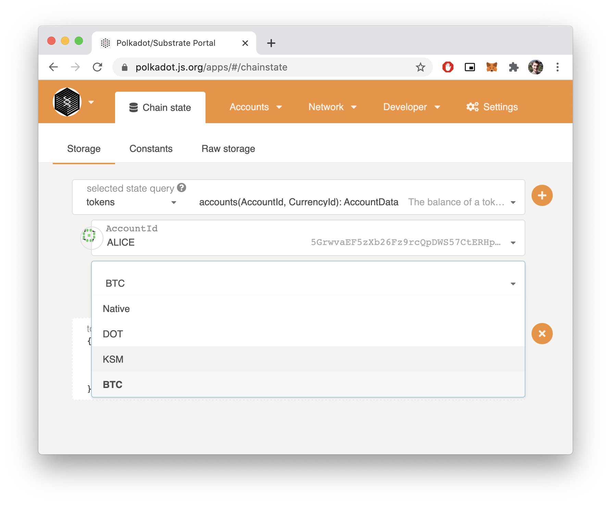

# Enable Multi-Currency Support

- Link: https://gitcoin.co/issue/AcalaNetwork/polakdot-hello-world-acala/2/100023952

I just added the `orml_tokens` pallet, not the `orml_currencies`.

# Result




## Project structure

- Node\*: [`./substrate-node-template-2.0.0`](./substrate-node-template-2.0.0/)

Useful commands:

```
cargo check -p node-template-runtime
```

# Resources

- https://github.com/open-web3-stack/open-runtime-module-library/tree/master/tokens
- https://github.com/xlc/orml-workshop/blob/master/runtime/src/lib.rs
- https://github.com/xlc/orml-workshop/commit/722ee66190bc4efcccdb39cf0dc2f6b49b2dc12f#diff-0ec06ea58bd455f09ce6b3bb4c2c1c0d37bda51c1e1be2151c560c9c973959ec

## Notes

- \* Cloned from the [substrate-node-template](https://github.com/substrate-developer-hub/substrate-node-template) `v2.0.0` repository (commit hash: [`24da7670a9a73fd6d868cfff105e2fd1f9be6f67`](https://github.com/substrate-developer-hub/substrate-node-template/commit/24da7670a9a73fd6d868cfff105e2fd1f9be6f67))
