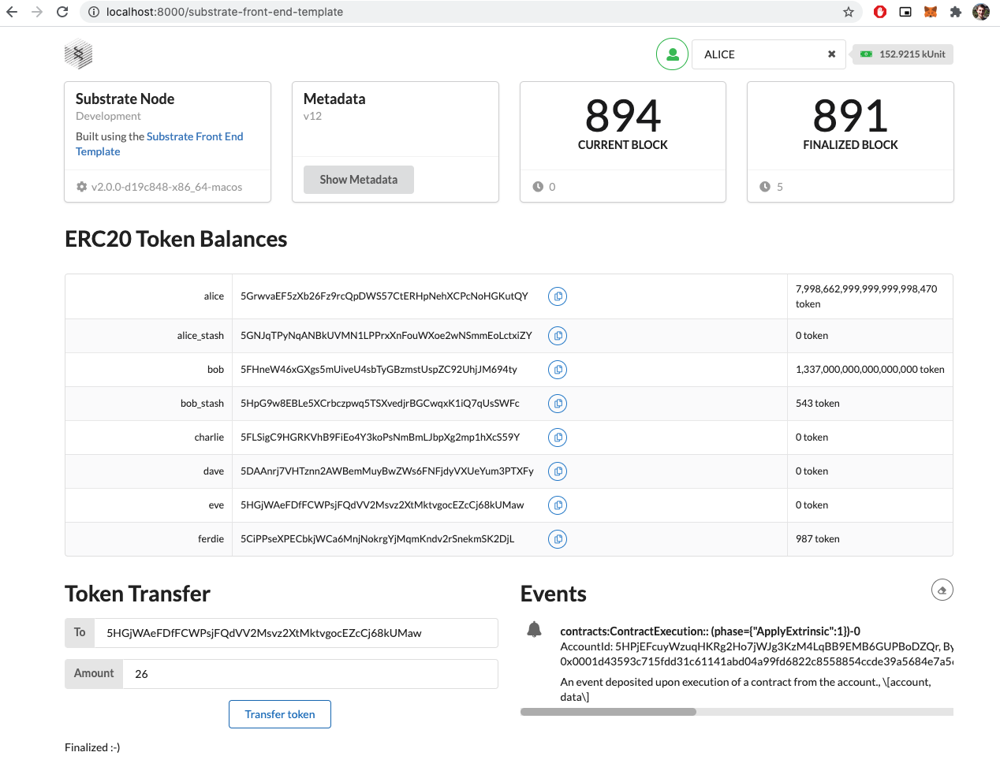

# Smart Contracts - Write An ERC-20 Smart Contract With Ink!

- Link: https://gitcoin.co/issue/Polkadot-Network/hello-world-by-polkadot/9/100023935
- Status: Submitted ✅

# Result

## Project structure

- Node\*: [`./substrate-node-template-2.0.0`](./substrate-node-template-2.0.0/)
- Frontend\*\*: [`./frontend`](./frontend/)
- Ink! Contract\*\*\*: [`./contract`](./contract/)

# Ressources

- https://substrate.dev/docs/en/tutorials/create-your-first-substrate-chain/setup
- https://substrate.dev/docs/en/tutorials/add-contracts-pallet/#importing-the-contracts-pallet-crate
- https://substrate.dev/rustdocs/v2.0.0/pallet_contracts/index.html
- https://substrate.dev/rustdocs/v2.0.0/pallet_contracts/trait.Trait.html
- https://github.com/paritytech/ink
- https://github.com/alekscp/ink/tree/master/examples/erc20
- https://github.com/paritytech/substrate/blob/v2.0.0/frame/contracts/src/lib.rs
- https://paritytech.github.io/canvas-ui/#/upload
- https://www.npmjs.com/package/@polkadot/api-contract

## Notes

- \* Cloned from the [substrate-node-template](https://github.com/substrate-developer-hub/substrate-node-template) `v2.0.0` repository (commit hash: [`24da7670a9a73fd6d868cfff105e2fd1f9be6f67`](https://github.com/substrate-developer-hub/substrate-node-template/commit/24da7670a9a73fd6d868cfff105e2fd1f9be6f67))
- \*\* Cloned from the [substrate-front-end-template](https://github.com/substrate-developer-hub/substrate-front-end-template) repository (commit hash: [`accd5ea1c5cebaae3e513fb622c34ca356b9c820`](https://github.com/substrate-developer-hub/substrate-front-end-template/commit/accd5ea1c5cebaae3e513fb622c34ca356b9c820))
- \*\*\* Cloned from [ink/examples](https://github.com/paritytech/ink/tree/master/examples)
