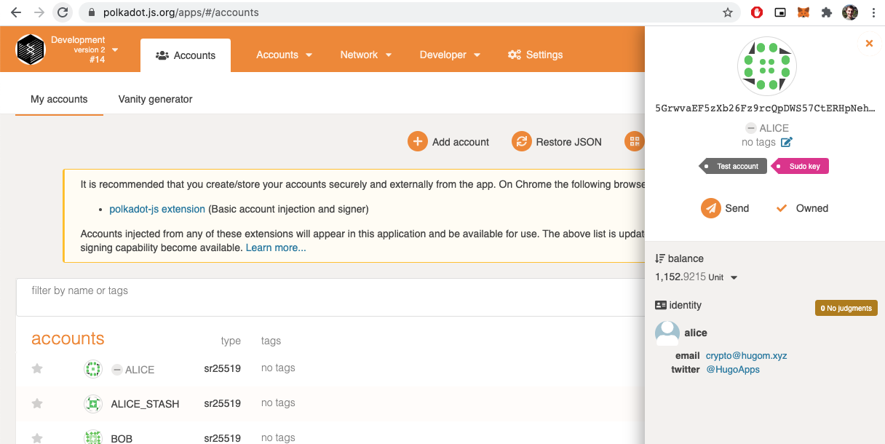

# FRAME Identity: Set An Identity On A Local --Dev Chain

- Link: https://gitcoin.co/issue/Polkadot-Network/hello-world-by-polkadot/10/100023936
- Status: Submitted [link](https://raw.githubusercontent.com/Hugoo/polkadot-hackathon/main/challenges/frame-identity-local/local-id.png) ✅

# Result

# Resources

- https://github.com/paritytech/substrate/tree/master/frame/identity
- https://github.com/paritytech/polkadot/blob/master/runtime/kusama/src/lib.rs
- https://substrate.dev/rustdocs/v2.0.0/pallet_identity/index.html
- https://substrate.dev/docs/en/tutorials/add-a-pallet/
