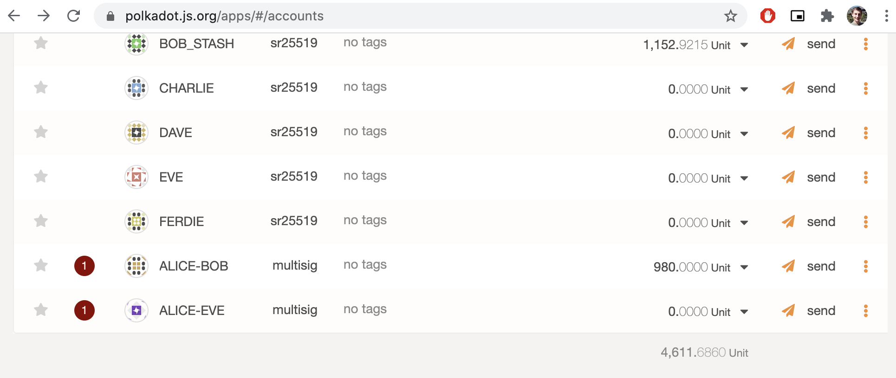
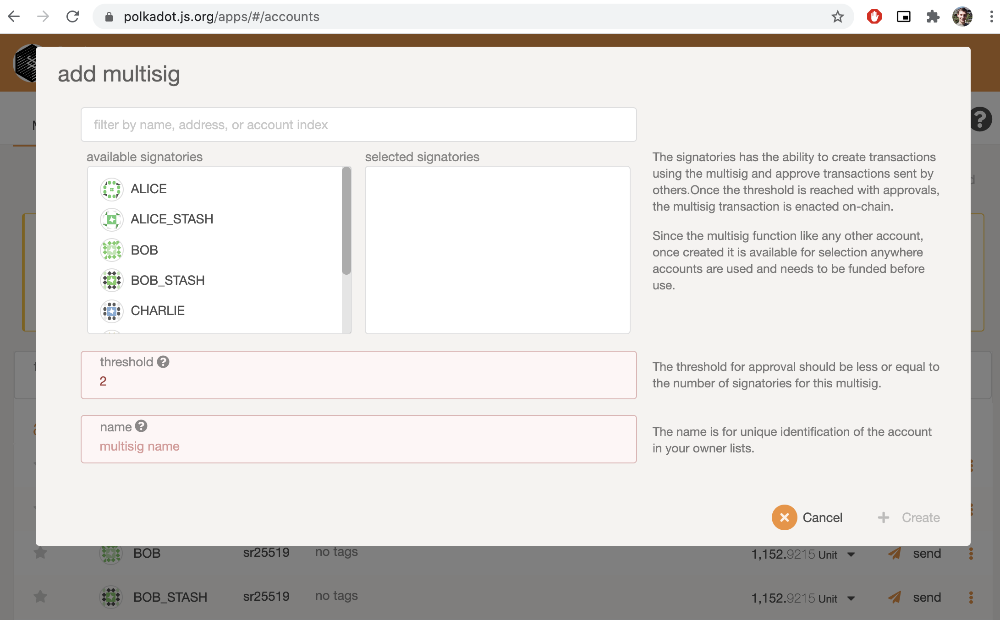
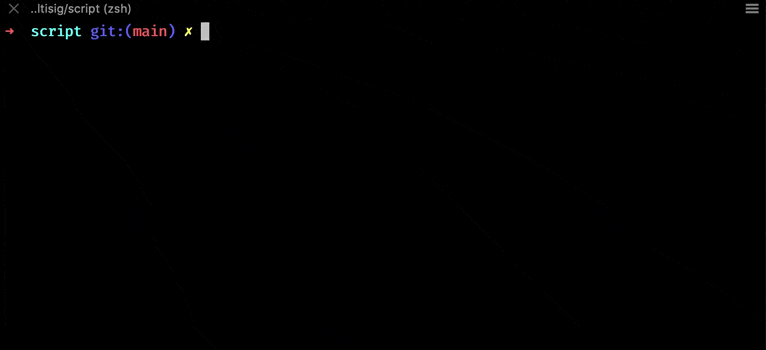

# Front-End Javascript

- Link: https://gitcoin.co/issue/Polkadot-Network/hello-world-by-polkadot/8/100023934
- Status: Submitted ✅

# Result

- Add pallet added to node
- Add new [`MultiSig`](./substrate-front-end-template-2.0.0/src/MultiSig.js) component in frontend to perform a multisig transaction
- Add [script](./script) to perform multisig transaction

# Resources

- https://substrate.dev/rustdocs/v2.0.0-rc6/pallet_multisig/trait.Trait.html

## Notes

- Node template cloned from the [substrate-node-template](https://github.com/substrate-developer-hub/substrate-node-template) `v2.0.0` repository (commit hash: [`24da7670a9a73fd6d868cfff105e2fd1f9be6f67`](https://github.com/substrate-developer-hub/substrate-node-template/commit/24da7670a9a73fd6d868cfff105e2fd1f9be6f67))
- Frontend template cloned from the [substrate-front-end-template](https://github.com/substrate-developer-hub/substrate-front-end-template) repository (commit hash: [`accd5ea1c5cebaae3e513fb622c34ca356b9c820`](https://github.com/substrate-developer-hub/substrate-front-end-template/commit/accd5ea1c5cebaae3e513fb622c34ca356b9c820))
