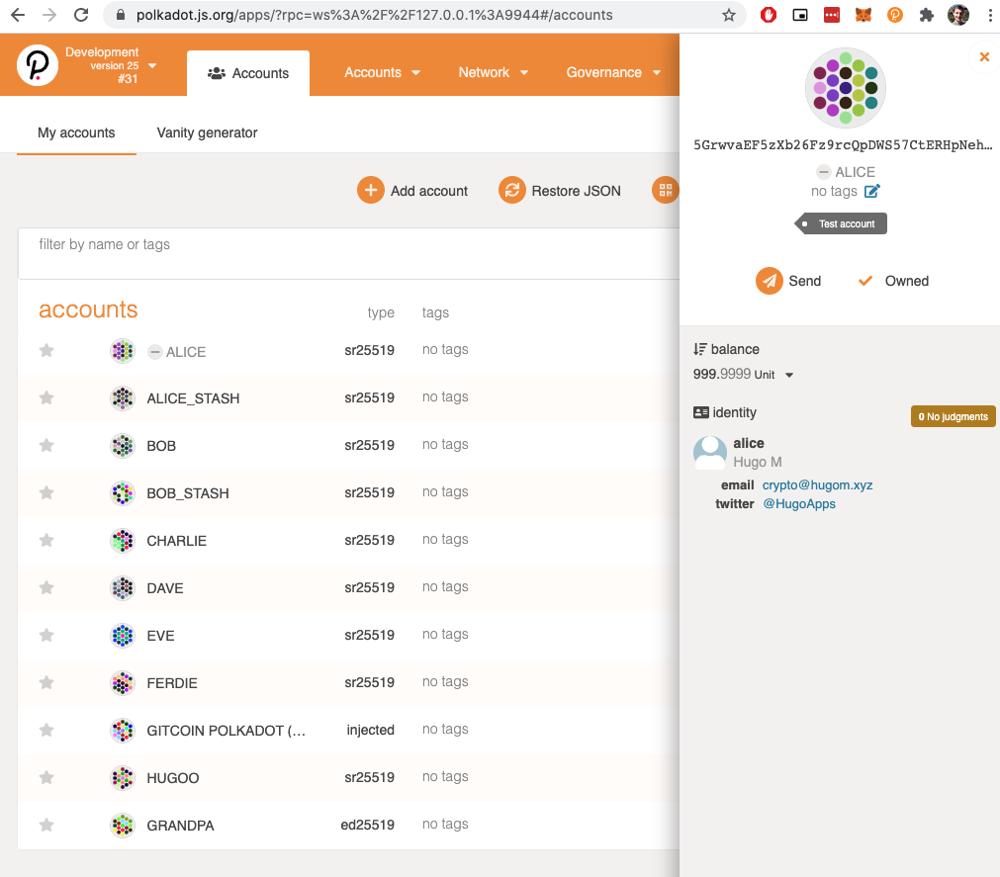
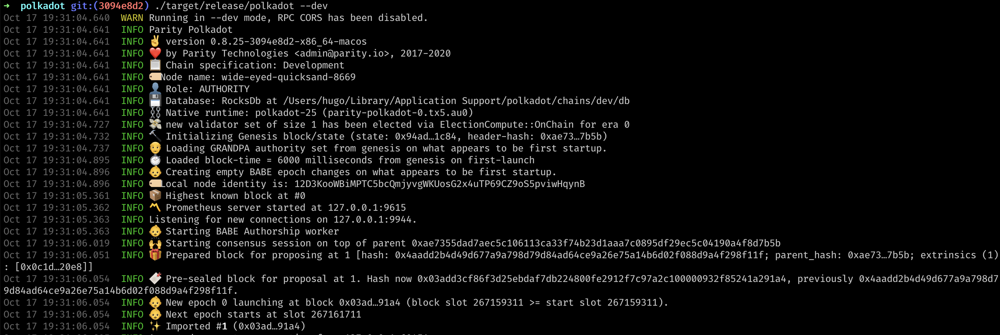

# Set An Identity On Kusama Or Polkadot's Development Version

- Link: https://gitcoin.co/issue/Polkadot-Network/hello-world-by-polkadot/11/100023937
- Status: Submitted [link](https://github.com/Hugoo/polkadot-hackathon/blob/main/challenges/id-dev-version/id.png) ✅

# Result

# Resources

- https://wiki.polkadot.network/docs/en/learn-identity
