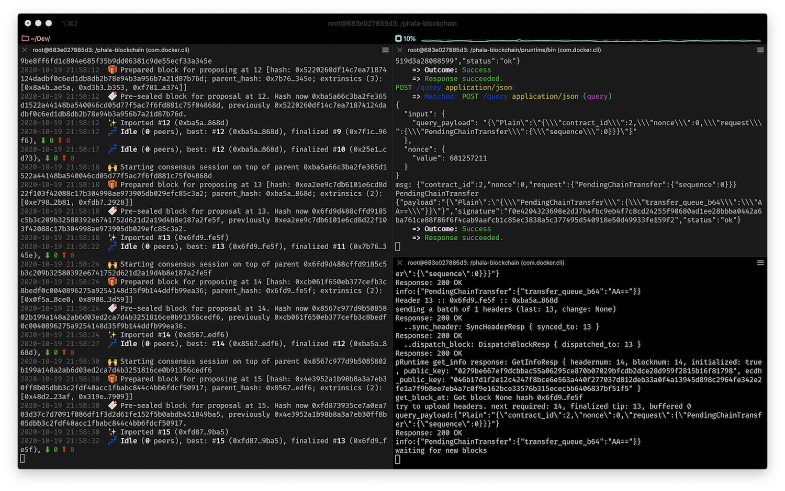
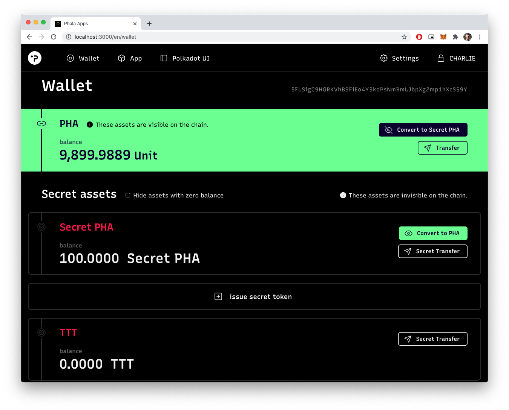

# Build And Run A Local Phala Network

- Link: https://gitcoin.co/issue/Phala-Network/hello-world-by-polkadot/1/100023945
- Status: Submitted [link](https://github.com/Hugoo/polkadot-hackathon/tree/main/challenges/local-phala-network) ✅

# Result

- Running terminals
  

- Tokens
  

- Tweet: [link](https://twitter.com/HugoApps/status/1318312774309761024)

# Notes

I've built the images inside a docker container. I needed to start the node with `--ws-external --rpc-external --rpc-cors all` in order to make it work properly.

```
source /opt/intel/sgxsdk/environment
./target/release/phala-node --dev --ws-external --rpc-external --rpc-cors all
./target/release/phost --dev

```

# Resources

- https://wiki.phala.network/en-us/docs/run-a-local-development-network/
