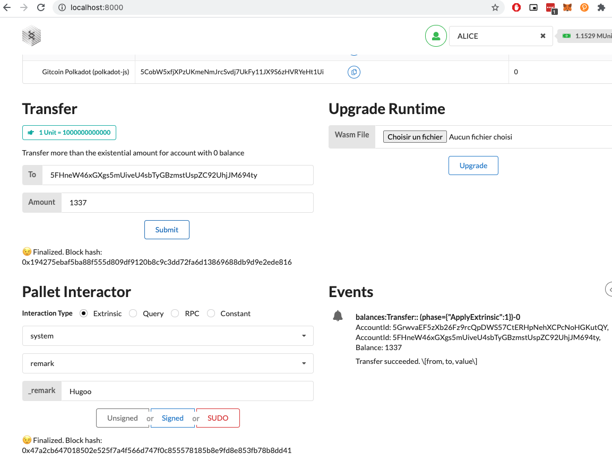
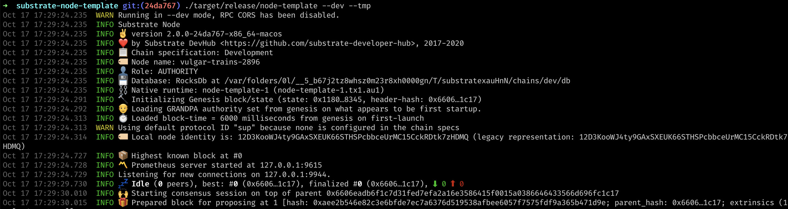

# Launch A Local Substrate Development Chain

- Link: https://gitcoin.co/issue/Polkadot-Network/hello-world-by-polkadot/17/100023943
- Status: Submitted [link](https://github.com/Hugoo/polkadot-hackathon/blob/main/challenges/local-substrate-dev-chain/proof.png) ✅

# Result




# Notes

Using lastest nightly was causing compile issues for Substrate:

```
 error[E0282]: type annotations needed
      --> /Users/user/.cargo/registry/src/github.com-1ecc6299db9ec823/sp-arithmetic-2.0.0/src/fixed_point.rs:541:9
       |
  541  |                   let accuracy = P::ACCURACY.saturated_into();
       |                       ^^^^^^^^ consider giving `accuracy` a type
  ...
  1604 | / implement_fixed!(
  1605 | |     FixedI128,
  1606 | |     test_fixed_i128,
  1607 | |     i128,
  ...    |
  1611 | |         [-170141183460469231731.687303715884105728, 170141183460469231731.687303715884105727]_",
  1612 | | );
       | |__- in this macro invocation
       |
       = note: this error originates in a macro (in Nightly builds, run with -Z macro-backtrace for more info)
```

I had to downgrade: https://github.com/paritytech/substrate/issues/7150#issuecomment-695344950

```
rustup toolchain list

rustup toolchain default 1.45.1-x86_64-apple-darwin
rustup target add wasm32-unknown-unknown --toolchain nightly-2020-08-19-x86_64-unknown-linux-gnu
rustup toolchain install nightly-2020-08-19-x86_64-unknown-linux-gnu
```

## Ressources

- https://substrate.dev/docs/en/tutorials/create-your-first-substrate-chain/
- https://github.com/paritytech/substrate/issues/7287
- https://doc.rust-lang.org/edition-guide/rust-2018/rustup-for-managing-rust-versions.html
