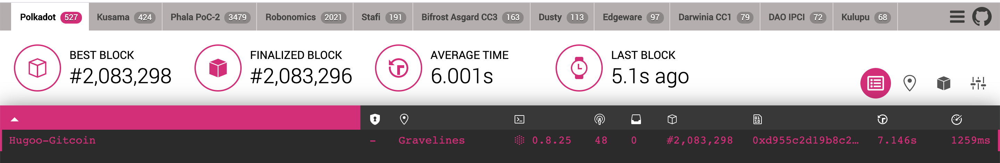

# Run A Kusama Or Polkadot Node And Add It To Telemetry

- Link: https://gitcoin.co/issue/Polkadot-Network/hello-world-by-polkadot/12/100023938
- Status: Submitted [link](https://github.com/Hugoo/polkadot-hackathon/tree/main/challenges/node-telemetry) ✅

# Result

- Node name: `Hugoo-Gitcoin`
- Start date: `2020-10-17T14:13:57+00:00`
- Ran at least until: `2020-10-18T22:56:35+00:00`

Node is running on a OVH VPS

# Resources

- https://wiki.polkadot.network/docs/en/maintain-sync
- https://github.com/paritytech/polkadot/#connect-to-polkadot-mainnet
