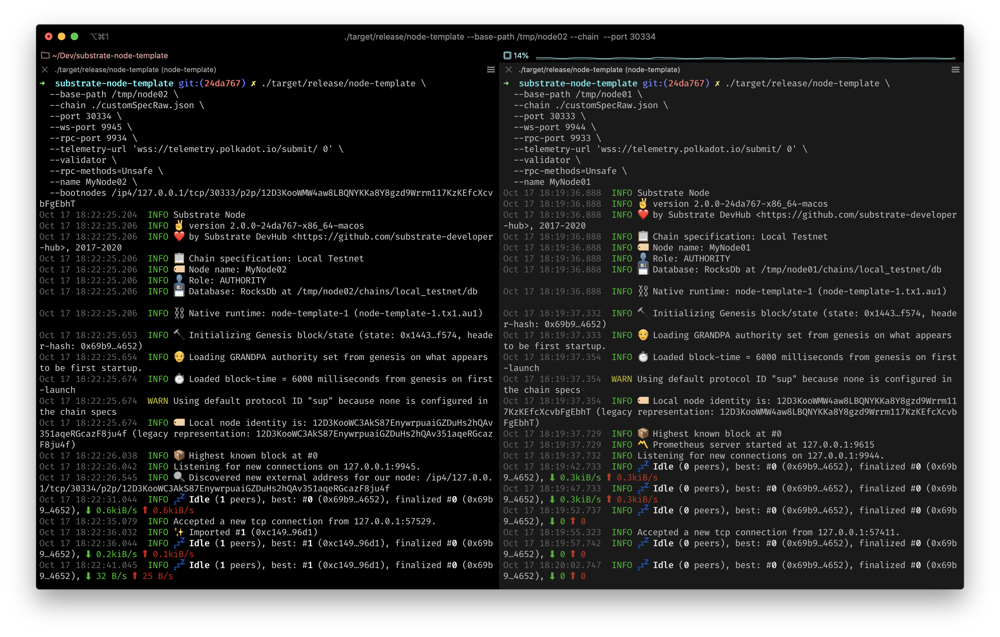

# Run A Private Substrate Network

- Link: https://gitcoin.co/issue/Polkadot-Network/hello-world-by-polkadot/16/100023942
- Status: Submitted [link](https://raw.githubusercontent.com/Hugoo/polkadot-hackathon/main/challenges/run-a-private-substrate-network/run.png) ✅

# Result

# Notes

I had some issues with building substrate, see the other challenge [README.md](../local-substrate-dev-chain) for mor einformaiton.

## Ressources

- https://substrate.dev/docs/en/tutorials/start-a-private-network/
- https://polkadot.js.org/apps/#/settings?rpc=ws://127.0.0.1:9944
